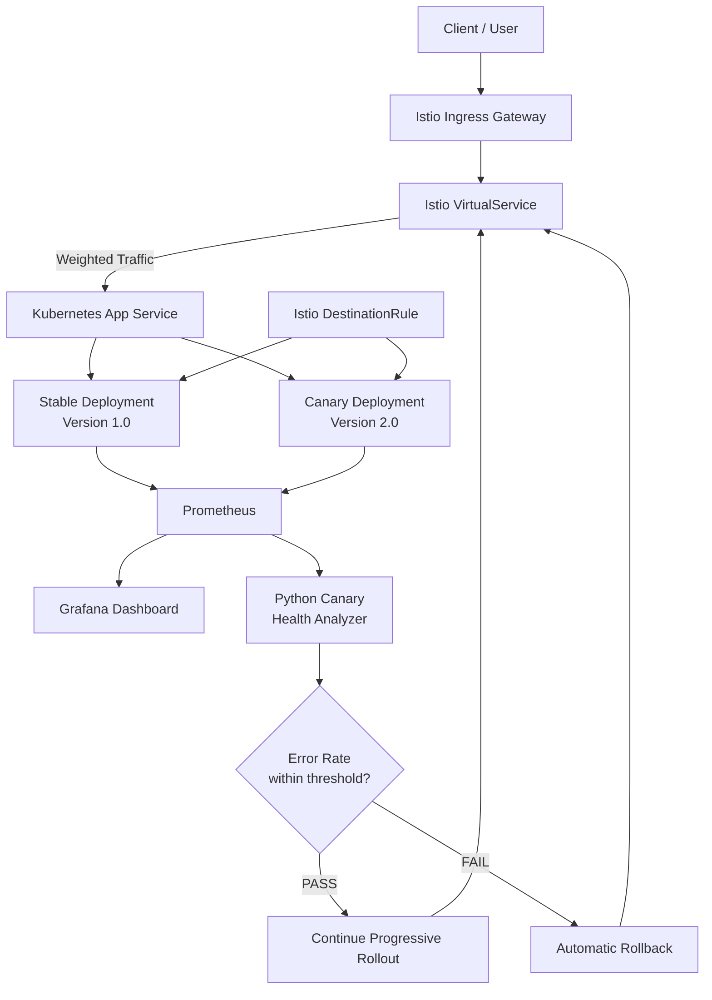
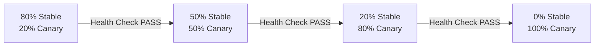
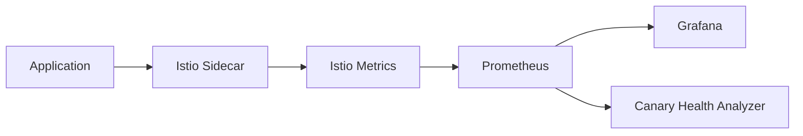
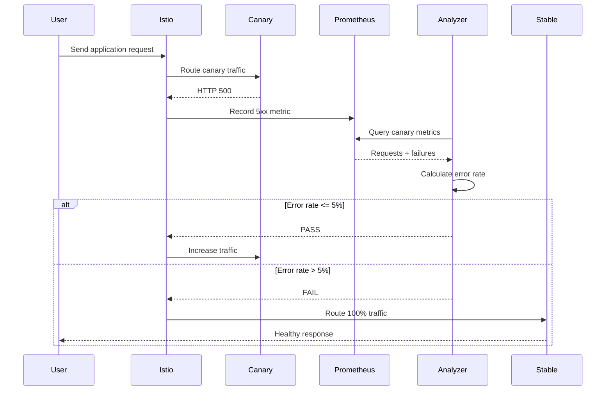

# 🚀 Production-Style Kubernetes Canary Deployment with Automated Rollback

> **A production-style Kubernetes canary deployment platform using K3s, Istio, Helm, Prometheus, Grafana, and an automated health analyzer for progressive delivery and failure recovery.**


---

## 📌 Project Overview

This project implements a **production-style Kubernetes Canary Deployment system** designed to release a new application version gradually while continuously monitoring its health.

Instead of immediately replacing the stable application with a new version, traffic is progressively shifted from the stable version to the canary version.

The system monitors the canary using **Istio and Prometheus**. A Python-based **Canary Health Analyzer** evaluates the canary's HTTP error rate.

If the canary exceeds the configured error threshold, the system automatically changes the Istio traffic configuration and performs a **rollback to the stable version**.

### Core idea

```text
New Version
    ↓
Canary Deployment
    ↓
Small Percentage of Traffic
    ↓
Monitor Metrics
    ↓
Health Analysis
    ↓
       ┌───────────────┐
       │               │
      PASS            FAIL
       │               │
       ↓               ↓
Increase Traffic   Automatic Rollback
       │               │
       ↓               ↓
100% Canary       100% Stable
```

---

# 🎯 Project Objectives

The main objectives of this project are:

* Deploy applications using Kubernetes.
* Run a lightweight Kubernetes cluster using K3s.
* Containerize application versions using Docker.
* Deploy Stable and Canary application versions simultaneously.
* Use Istio for service-mesh-based traffic management.
* Implement weighted traffic splitting.
* Perform progressive canary rollout.
* Monitor application traffic and errors using Prometheus.
* Visualize metrics using Grafana.
* Simulate a real application failure.
* Automatically detect canary failure.
* Automatically rollback traffic to the stable version.
* Package Kubernetes resources using Helm.
* Demonstrate a production-style progressive delivery workflow.

---

# 🏗️ Architecture

## High-Level Architecture



---

# 🔍 Detailed Architecture

The system consists of several major components.

## 1. Client

The client sends HTTP requests to the application.

For testing, requests are sent through the Istio Ingress Gateway using:

```bash
curl -H "Host: canary-demo.local" http://localhost:30646
```

The Host header allows the Istio Gateway and VirtualService to identify the application route.

---

## 2. K3s Kubernetes Cluster

The project uses **K3s**, a lightweight Kubernetes distribution.

K3s provides:

* Kubernetes API server
* Scheduler
* Controller manager
* Container runtime
* Kubernetes networking
* Deployment management
* Service discovery

The application workloads run inside the Kubernetes namespace:

```text
canary-demo
```

---

# 🐳 3. Dockerized Applications

Two application versions are maintained.

### Stable Version

```text
Version: 1.0
Environment: stable
```

### Canary Version

```text
Version: 2.0
Environment: canary
```

Both applications are simple Python Flask services.

### Stable response

```json
{
  "application": "Kubernetes Canary Demo",
  "version": "1.0",
  "environment": "stable"
}
```

### Healthy Canary response

```json
{
  "application": "Kubernetes Canary Demo",
  "version": "2.0",
  "environment": "canary"
}
```

---

# ☸️ 4. Kubernetes Deployments

Two Kubernetes Deployments are used:

```text
stable-v1
canary-v2
```

Each deployment runs multiple replicas.

The Stable Deployment uses:

```text
canary-stable:v1
```

The Canary Deployment uses:

```text
canary-canary:v2
```

Each deployment is identified using Kubernetes labels.

### Stable

```yaml
app: canary-demo
version: stable
```

### Canary

```yaml
app: canary-demo
version: canary
```

These labels are important because Istio uses them to identify the Stable and Canary subsets.

---

# 🌐 5. Kubernetes Service

The application uses a common Kubernetes Service:

```text
app-service
```

The Service selects:

```yaml
app: canary-demo
```

This allows both Stable and Canary pods to be reachable through the same service.

Istio then uses the DestinationRule to separate traffic between the two versions.

---

# 🕸️ 6. Istio Service Mesh

Istio provides the traffic-management layer of the project.

The main Istio resources are:

```text
Gateway
DestinationRule
VirtualService
```

---

## Istio Gateway

The Gateway exposes the application through the Istio Ingress Gateway.

```text
Client
  ↓
Istio Ingress Gateway
  ↓
VirtualService
```

The project uses the hostname:

```text
canary-demo.local
```

---

# 🎯 7. Istio DestinationRule

The DestinationRule defines two subsets:

```text
stable
canary
```

Stable subset:

```yaml
version: stable
```

Canary subset:

```yaml
version: canary
```

This allows Istio to distinguish between the two application versions.

---

# ⚖️ 8. Istio VirtualService

The VirtualService controls traffic distribution.

Example:

```yaml
http:
  - route:
      - destination:
          host: app-service.canary-demo.svc.cluster.local
          subset: stable
        weight: 50

      - destination:
          host: app-service.canary-demo.svc.cluster.local
          subset: canary
        weight: 50
```

This means:

```text
Stable → 50%
Canary → 50%
```

The traffic percentages can be changed dynamically without redeploying the application.

---

# 🔄 Progressive Canary Deployment

The project supports progressive traffic shifting.

The rollout sequence is:

```text
80% Stable
20% Canary
        ↓
50% Stable
50% Canary
        ↓
20% Stable
80% Canary
        ↓
0% Stable
100% Canary
```

At every stage, the Canary Health Analyzer evaluates the canary.

### Progressive rollout concept



If any stage fails:

```text
Current Stage
     ↓
Health Check
     ↓
FAIL
     ↓
Automatic Rollback
     ↓
100% Stable
```

---

# 📊 Monitoring Architecture

Prometheus collects Istio telemetry.

The monitoring flow is:



Prometheus tracks metrics such as:

* Request count
* HTTP response codes
* 5xx errors
* Destination version
* Traffic distribution
* Request rates

A key metric used by the analyzer is:

```text
istio_requests_total
```

---

# 📈 Grafana

Grafana provides visualization of the monitoring data collected by Prometheus.

The dashboard can be used to observe:

* Total request rate
* Stable request rate
* Canary request rate
* HTTP 5xx errors
* Canary health
* Traffic distribution

Prometheus acts as the metrics source while Grafana provides the visualization layer.

---

# 🤖 Intelligent Canary Health Analyzer

A Python-based analyzer was developed to automatically evaluate the canary.

Location:

```text
automation/canary_analyzer.py
```

The analyzer queries Prometheus and calculates:

```text
Error Rate =
Failed Canary Requests
----------------------
Total Canary Requests
× 100
```

---

# 🛡️ Safety Controls

The analyzer contains two important safety controls.

## Minimum Request Requirement

The analyzer requires at least:

```text
5 Canary Requests
```

before making a health decision.

This prevents the system from making a decision using an extremely small sample.

If fewer than five requests are available:

```text
Decision : NO_DATA
Action   : STOP ROLLOUT
```

---

## Error Threshold

The configured error threshold is:

```text
5%
```

If:

```text
Error Rate <= 5%
```

the canary passes.

If:

```text
Error Rate > 5%
```

the canary fails.

---

# 🚨 Failure Simulation

A deliberate application failure was introduced to test the rollback mechanism.

The failed Canary version returns:

```text
HTTP 500
```

for the normal application endpoint.

However, the `/health` endpoint continues returning:

```text
HTTP 200
```

This design is important.

It allows Kubernetes to consider the pod healthy and ready while the actual application traffic is failing.

### Failure endpoint

```text
GET /
→ HTTP 500
```

### Health endpoint

```text
GET /health
→ HTTP 200
```

This simulates a realistic application-level failure rather than simply killing the Kubernetes pod.

---

# 🔥 Automated Rollback

When the analyzer detects:

```text
Error Rate > 5%
```

it automatically executes an Istio VirtualService patch.

The traffic is changed to:

```text
Stable → 100%
Canary → 0%
```

The rollback mechanism therefore does not require manually redeploying the stable application.

---

# 🧪 Verified Failure Test

The failure scenario was successfully tested.

Traffic was configured as:

```text
Stable = 50%
Canary = 50%
```

Requests were generated through the Istio Gateway.

The failed Canary returned HTTP 500 responses.

Prometheus recorded the failed requests.

The analyzer produced:

```text
Canary Metrics
------------------------------------------
Total Requests  : 8
Failed Requests : 8
Error Rate      : 100.00%
------------------------------------------

Decision : FAIL
Reason   : Error rate 100.00% exceeds 5.00%
```

The automated rollback then executed:

```text
==========================================
       AUTOMATIC ROLLBACK
==========================================

Stable traffic : 100%
Canary traffic : 0%

ROLLBACK COMPLETED
==========================================
```

The final Istio configuration was verified as:

```text
stable=100% canary=0%
```

This confirms that the automated rollback mechanism works.

---

# 🧪 Progressive Rollout Test Results

The healthy Canary was tested through progressive traffic stages.

### 80/20

```text
Canary Requests : 5
Failed Requests : 0
Error Rate      : 0.00%
Decision         : PASS
```

### 50/50

After sufficient traffic generation:

```text
Canary Requests : 172
Failed Requests : 0
Error Rate      : 0.00%
Decision         : PASS
```

### 20/80

```text
Canary Requests : 489
Failed Requests : 0
Error Rate      : 0.00%
Decision         : PASS
```

### 100% Canary

```text
Canary Requests : 121
Failed Requests : 0
Error Rate      : 0.00%
Decision         : PASS
```

These tests demonstrate that a healthy application can progressively receive increasing amounts of traffic.

---

# 📦 Helm Deployment

The project includes a Helm chart:

```text
helm/canary-platform/
```

Structure:

```text
helm/
└── canary-platform/
    ├── Chart.yaml
    ├── values.yaml
    └── templates/
        ├── _helpers.tpl
        ├── namespace.yaml
        ├── stable-deployment.yaml
        ├── canary-deployment.yaml
        ├── service.yaml
        ├── gateway.yaml
        ├── destination-rule.yaml
        └── virtual-service.yaml
```

Helm allows the Kubernetes configuration to be packaged and deployed as a reusable application chart.

---

# ⚙️ Helm Configuration

Traffic weights are configurable through:

```yaml
traffic:
  stable: 50
  canary: 50
```

Application replicas can also be configured:

```yaml
stable:
  replicas: 2

canary:
  replicas: 2
```

Images are configurable:

```yaml
stable:
  image: canary-stable:v1

canary:
  image: canary-canary:v2
```

---

# 📁 Project Structure

```text
production-style-kubernetes-canary/
│
├── app/
│   ├── stable/
│   │   ├── app.py
│   │   └── Dockerfile
│   │
│   └── canary/
│       ├── app.py
│       └── Dockerfile
│
├── automation/
│   ├── canary_analyzer.py
│   └── progressive_rollout.sh
│
├── helm/
│   └── canary-platform/
│       ├── Chart.yaml
│       ├── values.yaml
│       └── templates/
│           ├── _helpers.tpl
│           ├── namespace.yaml
│           ├── stable-deployment.yaml
│           ├── canary-deployment.yaml
│           ├── service.yaml
│           ├── gateway.yaml
│           ├── destination-rule.yaml
│           └── virtual-service.yaml
│
├── k3s/
│   ├── namespace.yaml
│   ├── stable-deployment.yaml
│   ├── stable-service.yaml
│   ├── canary-deployment.yaml
│   ├── canary-service.yaml
│   ├── app-service.yaml
│   ├── gateway.yaml
│   ├── destination-rule.yaml
│   ├── virtual-service.yaml
│   └── canary-dashboard.json
│
└── .gitignore
```

---

# 🛠️ Technology Stack

| Technology | Purpose                             |
| ---------- | ----------------------------------- |
| Python     | Application and health analyzer     |
| Flask      | Lightweight application API         |
| Docker     | Containerization                    |
| K3s        | Lightweight Kubernetes cluster      |
| Kubernetes | Container orchestration             |
| Istio      | Service mesh and traffic management |
| Helm       | Kubernetes packaging and deployment |
| Prometheus | Metrics collection                  |
| Grafana    | Monitoring visualization            |
| Bash       | Automation and rollout scripts      |
| Git/GitHub | Version control and project hosting |

---

# 🚀 Installation and Setup

## Prerequisites

Install:

* Docker
* K3s
* kubectl
* Helm
* Istio
* Python 3
* Git

---

# 1. Clone the Repository

```bash
git clone https://github.com/Harshinikm2005/production-style-kubernetes-canary.git
cd production-style-kubernetes-canary
```

---

# 2. Build Docker Images

### Stable

```bash
cd app/stable

docker build -t canary-stable:v1 .
```

### Canary

```bash
cd ../canary

docker build -t canary-canary:v2 .
```

---

# 3. Import Images into K3s

For a local K3s environment:

```bash
docker save canary-stable:v1 -o stable-v1.tar
sudo k3s ctr images import stable-v1.tar
```

```bash
docker save canary-canary:v2 -o canary-v2.tar
sudo k3s ctr images import canary-v2.tar
```

---

# 4. Deploy Kubernetes Resources

```bash
kubectl apply -f k3s/namespace.yaml
kubectl apply -f k3s/stable-deployment.yaml
kubectl apply -f k3s/stable-service.yaml
kubectl apply -f k3s/canary-deployment.yaml
kubectl apply -f k3s/canary-service.yaml
kubectl apply -f k3s/app-service.yaml
```

---

# 5. Install Istio

Install the required Istio version using `istioctl`.

Then enable automatic sidecar injection:

```bash
kubectl label namespace canary-demo istio-injection=enabled --overwrite
```

Restart workloads if required:

```bash
kubectl rollout restart deployment -n canary-demo
```

---

# 6. Configure Istio

Apply:

```bash
kubectl apply -f k3s/gateway.yaml
kubectl apply -f k3s/destination-rule.yaml
kubectl apply -f k3s/virtual-service.yaml
```

---

# 7. Install Prometheus

Apply the Prometheus deployment provided by Istio's sample addons.

Then access Prometheus locally:

```bash
kubectl port-forward -n istio-system svc/prometheus 9090:9090
```

Prometheus:

```text
http://localhost:9090
```

---

# 8. Install Grafana

Deploy Grafana using the Istio addon.

Access:

```text
http://localhost:3000
```

Prometheus can be configured as the Grafana data source.

---

# 9. Test Traffic

Send requests through the Istio Gateway:

```bash
for i in {1..20}; do
  curl -s \
    -H "Host: canary-demo.local" \
    http://localhost:30646
  echo
done
```

Responses should show either:

```text
version: 1.0
environment: stable
```

or:

```text
version: 2.0
environment: canary
```

depending on the configured traffic weights.

---

# 🤖 Run Canary Analyzer

Make sure Prometheus is accessible on:

```text
http://localhost:9090
```

Then run:

```bash
python3 automation/canary_analyzer.py
```

Possible results:

### PASS

```text
Decision : PASS
Action   : Continue rollout
```

### FAIL

```text
Decision : FAIL
Action   : Automatic Rollback
```

### NO_DATA

```text
Decision : NO_DATA
Action   : STOP ROLLOUT
```

---

# 🔄 Progressive Rollout

The progressive rollout automation is located at:

```text
automation/progressive_rollout.sh
```

The concept is:

```text
80/20
 ↓
Health Analysis
 ↓
50/50
 ↓
Health Analysis
 ↓
20/80
 ↓
Health Analysis
 ↓
100% Canary
```

If a health check fails at any stage:

```text
FAIL
 ↓
STOP
 ↓
ROLLBACK
 ↓
100% Stable
```

---

# 🔐 Failure Recovery Workflow

The complete failure-recovery workflow is:



---

# 🧠 Why This Project Is Different

A basic Kubernetes project might only demonstrate:

```text
Docker
 ↓
Kubernetes
 ↓
Deployment
```

This project goes further by implementing:

```text
Containerization
      ↓
Kubernetes
      ↓
Service Mesh
      ↓
Traffic Splitting
      ↓
Progressive Delivery
      ↓
Observability
      ↓
Automated Health Analysis
      ↓
Failure Detection
      ↓
Automated Rollback
```

The project therefore demonstrates concepts from:

* Kubernetes
* DevOps
* Cloud Native
* Service Mesh
* Observability
* Progressive Delivery
* Site Reliability Engineering
* Automation

---

# 📊 Project Validation

The following major scenarios were tested.

| Test                | Expected Result           | Status |
| ------------------- | ------------------------- | ------ |
| Stable application  | HTTP 200                  | ✅      |
| Healthy Canary      | HTTP 200                  | ✅      |
| Istio traffic split | Stable + Canary traffic   | ✅      |
| Progressive rollout | Increasing Canary traffic | ✅      |
| Prometheus metrics  | Request/error metrics     | ✅      |
| Grafana             | Metrics visualization     | ✅      |
| Canary failure      | HTTP 500                  | ✅      |
| Analyzer detection  | FAIL                      | ✅      |
| Automatic rollback  | 100% Stable               | ✅      |
| Helm chart          | Deployment package        | ✅      |

---

# 🔮 Future Enhancements

Possible future improvements include:

* Automated GitHub Actions CI/CD pipeline
* Argo Rollouts integration
* Automated Docker image builds
* Kubernetes HPA
* CPU and memory-based rollout decisions
* Latency-based canary analysis
* SLO-based automated rollback
* Slack/Email notifications
* Loki centralized logging
* Jaeger distributed tracing
* Multi-node K3s cluster
* External monitoring
* Security scanning with Trivy
* GitOps deployment using Argo CD

---

# 🎓 Learning Outcomes

This project provides practical experience with:

### Kubernetes

* Deployments
* Services
* Namespaces
* Labels and selectors
* ReplicaSets
* Health probes

### Istio

* Gateway
* VirtualService
* DestinationRule
* Subsets
* Weighted traffic routing
* Service mesh telemetry

### Observability

* Prometheus
* Grafana
* HTTP metrics
* Error-rate analysis

### DevOps Automation

* Bash scripting
* Python automation
* Progressive rollout
* Automated rollback

### Helm

* Helm charts
* Values
* Templates
* Kubernetes packaging

---

# 👩‍💻 Author

**Harshini K M**

GitHub:

https://github.com/Harshinikm2005

Project:

https://github.com/Harshinikm2005/production-style-kubernetes-canary

---

# ⭐ Project Summary

This project demonstrates a **production-style progressive delivery system for Kubernetes applications**.

A new application version is introduced as a Canary deployment and receives controlled traffic through Istio. Prometheus collects telemetry while Grafana provides observability. A Python-based health analyzer evaluates Canary error rates and determines whether the rollout should continue.

When the Canary becomes unhealthy, the system automatically detects the failure and changes the Istio traffic configuration to:

```text
100% Stable
0% Canary
```

This provides an automated safety mechanism for releasing application changes while reducing the risk of exposing users to a faulty deployment.

---

## 🔥 Key Architecture

```text
                         ┌──────────────────────┐
                         │        CLIENT        │
                         └──────────┬───────────┘
                                    │
                                    ▼
                     ┌──────────────────────────┐
                     │   ISTIO INGRESS GATEWAY  │
                     └────────────┬─────────────┘
                                  │
                                  ▼
                     ┌──────────────────────────┐
                     │    VIRTUAL SERVICE       │
                     │                          │
                     │  Traffic Weight Control  │
                     └────────────┬─────────────┘
                                  │
                    ┌─────────────┴─────────────┐
                    │                           │
              Stable Traffic              Canary Traffic
                    │                           │
                    ▼                           ▼
          ┌─────────────────┐        ┌─────────────────┐
          │  STABLE v1.0    │        │  CANARY v2.0    │
          │                 │        │                 │
          │  Kubernetes     │        │  Kubernetes     │
          │  Deployment     │        │  Deployment     │
          └────────┬────────┘        └────────┬────────┘
                   │                          │
                   └────────────┬─────────────┘
                                │
                                ▼
                     ┌─────────────────────────┐
                     │        ISTIO            │
                     │      TELEMETRY          │
                     └────────────┬────────────┘
                                  │
                                  ▼
                     ┌─────────────────────────┐
                     │      PROMETHEUS         │
                     │                         │
                     │ Requests / Errors / 5xx │
                     └───────┬─────────┬───────┘
                             │         │
                             ▼         ▼
                       ┌─────────┐ ┌───────────────┐
                       │ Grafana │ │ Python        │
                       │         │ │ Health        │
                       │Dashboard│ │ Analyzer      │
                       └─────────┘ └───────┬───────┘
                                           │
                                           ▼
                                  ┌─────────────────┐
                                  │ Health Decision │
                                  └────────┬────────┘
                                           │
                              ┌────────────┴────────────┐
                              │                         │
                            PASS                      FAIL
                              │                         │
                              ▼                         ▼
                     Continue Rollout          AUTOMATIC ROLLBACK
                                                        │
                                                        ▼
                                                ┌──────────────┐
                                                │ 100% STABLE  │
                                                │  0% CANARY   │
                                                └──────────────┘
```

---

## 🚀 Production-Style Canary Deployment

**K3s + Kubernetes + Istio + Helm + Prometheus + Grafana + Python Automation**

> **Progressive delivery with continuous monitoring and automatic failure recovery.**
